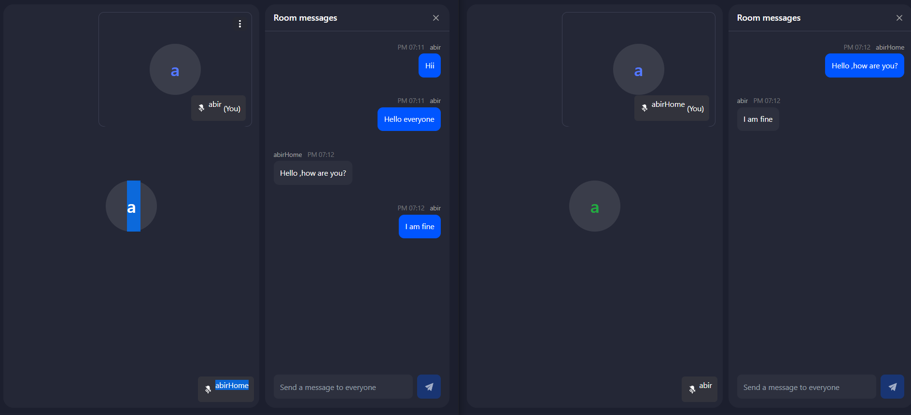

# LIVE CHAT VIDEO APPLICATION
  A complete application where we can meet in one place just by have an online meet .

* `Tech Stacks include:`
1. `ReactJs`
2. `NodeJs`
3. `Tailwind CSS`
4. `MongoDb`

For this Live chat working Feature Like any Zoom Meeting we, have used here a Third Party Integration named:
**Zego Cloud**

## Zego Cloud
## It provides Features for cretaing a room where you can use your Meeting Id & join as many Members to colloborate together on same pace.
## Key Features that  are being used :
 * Audio 
 * Video
 * Live Chat Features to communicate.

  Further we can Add some more features using any Third Party Like :***Recording ,Emojis Selection***.

## Page has Links to : About,Contact & Blogs that need to be Updated later.

# Images of the above process when executed

1. Visiting the **Home Page**** by Starting the Project having beautiful Background

2. Enter the **Room Number** with which you want to join the Room & share Meeting Id

**Note: This Meeting Id should be the same while Sgaring with your friend & Colleagues to be in Same room.**

3. On Room Enter ,you will come to **Page landing with your Audio & Video** to be Default Start.You can Join with Any Name & share it.

 

 4. Once you Enter the room , you are Ready to Enjoy the **Live Chat Platform.**You can Chat,talk and even have face to face Communication.

**Note: Here At last Room Enter we can Clearly see to have conversation in A single room with one another**

## ***My Deployed Link-LIVE CHAT APPLICATION***

[Live Chat Project](https://live-chat-abir.netlify.app/)

**Looking forward for your Feedback**

### Note: I am Updating the Contact form with Real time Data of User to be inserted in Database using `MONGODB`

* More Features will be added.